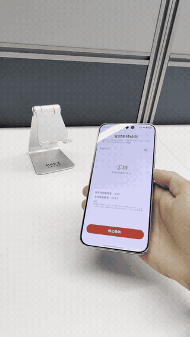

# PhoneInHand：基于 IMU 的手机支撑接触状态识别

使用 100 Hz 六轴 IMU，判断手机是否完全离开桌面并由手握持。本仓库提供当前 Demo 使用的 **R10 因果 CNN** 的数据、训练与评估代码；此前部署的 **R8** 模型作为历史版本一并归档。

## 手机端 Demo

以下视频展示 HarmonyOS Demo 的实时检测界面（约 37 秒）：



上方为 8 秒循环预览；[下载完整 37 秒视频（MP4）](assets/demo/phoneinhand_demo.mp4)。

## 任务与方法

| 标签 | 编码 | 定义 |
|---|---:|---|
| `non_handheld` | 0 | 手机仍与桌面等支撑面接触；即使手握住手机，也属于此类 |
| `handheld` | 1 | 手机完全离开支撑面，并由手握持 |

输入顺序为 `acc_x, acc_y, acc_z, gyro_x, gyro_y, gyro_z`。处理流程：

```text
IMU CSV → 按录制划分 / 裁剪 → 固定归一化 → 模型内 EMA 去重力
        → 因果 CNN → 逐帧分类 → 稳定判决 FSM（手机端）
```

CNN 使用 32 个通道、kernel 5、dilations `[1,2,4,8]`，感受野为 61 帧。模型支持逐帧推理，历史状态在相邻帧之间传递。

## 项目结构与数据

```text
PhoneInHand/       Python 数据处理、训练、评估
PhoneInHandDemo/   HarmonyOS 采集与实时推理
data/
  smartrotate/    SmartRotate 原始 CSV
  other/          其他来源原始 CSV
  splits/R10.json 当前 R10 固定训练 / 验证清单
  splits/R8.json   历史 R8 录制清单
models/R10/        当前模型、归一化参数、部署协议与参考结果
models/R8/         历史 checkpoint、手机模型、配方与验证结果
docs/              数据接口与模型登记
```

| 数据来源 | 原始录制 | R10 训练 | R10 验证 | 未使用 |
|---|---:|---:|---:|---:|
| SmartRotate | 72 | 72 | 0 | 0 |
| 其他来源 | 226 | 97 | 47 | 82 |
| 合计 | 298 | 169 | 47 | 82 |

训练与验证按完整 recording 隔离，重叠窗口不会跨集合。82 份未使用录制不参与 R10 实验。数据字段、来源与历史场景标签说明见 [data/README.md](data/README.md)。

## 环境安装

在仓库根目录打开终端。使用 Python 3.11，依赖版本固定在 [requirements.txt](PhoneInHand/requirements.txt)：

```bash
conda create -n phoneinhand python=3.11 -y
conda activate phoneinhand
python -m pip install -r PhoneInHand/requirements.txt
cd PhoneInHand
```

已有 `phoneinhand` 环境时直接激活。**以下 Python 命令均在 `PhoneInHand/` 目录执行。** CPU 评估可在 macOS、Windows、Linux 上运行；训练设备选择见下文。

## 复现流程

### 1. 数据准备

训练与评估入口自动读取 `data/splits/R10.json`。先按完整录制划分训练 / 验证，再分别处理各录制：

- **裁头**：按时间戳去掉每段录制最初 3 秒，裁剪结果缓存至 `runs/prepared/R10/`，原始 CSV 保留。
- **训练滑窗**：连续 128 帧组成一个样本，形状为 `[128,6]`，对应 1.28 秒。SmartRotate 的窗口每次后移 2 帧（20 ms），其他数据后移 1 帧（10 ms）。窗口不跨录制，不足 128 帧的候选窗口舍弃。
- **标签与预热**：窗口内各帧继承该录制的 `hold_state`。每个窗口前 60 帧用于模型预热，后 68 帧参与逐帧训练损失。

验证采用整段录制的流式推理，忽略该段前 60 帧的指标。归一化固定使用 `models/R10/norm_stats.json`，不从验证集拟合统计量。其他来源的每个训练窗口增加 3 个固定种子的 SO(3) 旋转副本，SmartRotate 不做旋转增强，共 **633,846 个训练窗口**。

### 2. 验证随附 R10 模型

建议先运行以下命令，确认环境、数据和模型能够完整跑通：

```bash
python -m src.evaluate --device cpu --output runs/R10_evaluation.json
```

终端输出总体指标，JSON 保存逐录制、逐场景的混淆矩阵及 FSM 结果。随附 checkpoint 在 **47 份录制、59,874 个有效帧**上的参考值：

| 指标 | R10 |
|---|---:|
| Accuracy | 97.4897% |
| Macro-F1 | 0.974865 |
| False Free Rate | 1.6822% |

`False Free Rate = P(pred=handheld | true=non_handheld)`，衡量手机仍接触支撑面却被判为手持的错误。上表是原始逐帧分类结果；FSM 结果另列，`unknown` 单独统计。该验证集同时用于选择最佳模型，结果不代表独立测试集性能。完整参考结果见 [reference_metrics.json](models/R10/reference_metrics.json)。

历史部署版 **R8** 的 checkpoint 和手机端 `.ms` 模型保存在 `models/R8/`，训练配方及录制清单分别见 [experiment_config.json](models/R8/experiment_config.json) 和 [R8.json](data/splits/R8.json)。R8 在其 39 条验证录制上的 Accuracy 为 98.5701%、Macro-F1 为 0.985659、False Free Rate 为 1.6434%，最佳轮为 31。R8 与 R10 使用不同验证划分，指标不宜直接横向比较；Demo 默认仍使用 R10。

### 3. 从头训练并评估

按设备选择一条训练命令：

| 平台 | 命令 |
|---|---|
| macOS / Apple GPU | `python -m src.train --device mps` |
| Windows、Linux / 可用 CUDA | `python -m src.train --device cuda` |
| Windows、Linux / CPU | `python -m src.train --device cpu` |

训练采用 seed 42、batch 64、50 epochs，从随机初始化开始；AdamW（LR `0.001`、weight decay `0.0001`）、cosine scheduler、weighted CE + `0.15 ×` 同标签 TMSE。完整配方见 [configs/R10.json](PhoneInHand/configs/R10.json)。macOS 训练要求 MPS 可用，CPU 训练耗时更长。

训练结果写入 `runs/R10_retrain/`：`causal_cnn_best.pt`、`norm_stats.json`、`experiment_config.json` 和 `train_history.json`。最佳模型按验证 Macro-F1 选择，平分时选后面的轮。训练完成后运行：

```bash
python -m src.evaluate --checkpoint runs/R10_retrain/causal_cnn_best.pt --device cpu --output runs/R10_retrain_evaluation.json
```

再次训练时用 `--output-dir runs/R10_retrain_2` 指定新目录。随附模型原训练使用 MPS，最佳第 12 轮；不同硬件重训可能存在数值差异。当前代码已通过完整 R10 评估和一个 MPS 训练 batch 检查，验证范围见 [HANDOFF_CHECKS.md](docs/HANDOFF_CHECKS.md)。

### 4. 手机采集与实时推理

1. 在 DevEco Studio 中打开仓库根目录下的 `PhoneInHandDemo/`，使用 HarmonyOS SDK **6.0.1 / API 21**，同步项目依赖。
2. 在 IDE 中配置自己的设备与本地签名，编译并运行 `entry` 模块。
3. 在采集页面选择用户及“手持 / 非手持”场景，完成采集后在结果页面查看保存的 CSV 路径；从首页进入实时检测，查看 R10 分类与概率。

Demo 已包含 R10 的 MindSpore Lite `.ms` 模型，归一化和流式状态接口与 Python 一致。FSM 使用手持证据阈值 `0.95` / 60 帧、非手持证据阈值 `0.1` / 35 帧，要求窗口内至少 90% 强证据。

**手机端复现使用随附的 R10 `.ms` 文件。** Python 重训生成 PyTorch checkpoint；将新 checkpoint 转换为 `.ms` 需另行配置转换工具，本仓库不包含转换脚本或签名材料。新采集数据也需建立新的录制划分与训练配置，现有 R10 清单保持固定。端侧操作见 [Demo README](PhoneInHandDemo/README.md)，接口见 [DATA_CONTRACT.md](docs/DATA_CONTRACT.md)，模型文件及参数见 [model_registry.md](docs/model_registry.md)。

## 代码来源

本项目的代码基础来自 mentor 提供的两个仓库：[PhoneInHand](https://github.com/zhangrui1123/PhoneInHand)（Python 数据处理、训练与评估）和 [PhoneInHandDemo](https://github.com/zhangrui1123/PhoneInHandDemo)（HarmonyOS 采集与端侧推理）。本仓库在此基础上筛选并整合可复现的核心代码、数据清单和 R8/R10 模型产物。
